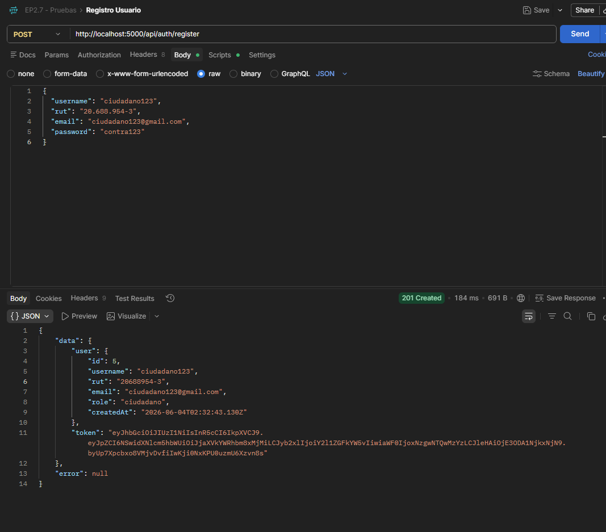
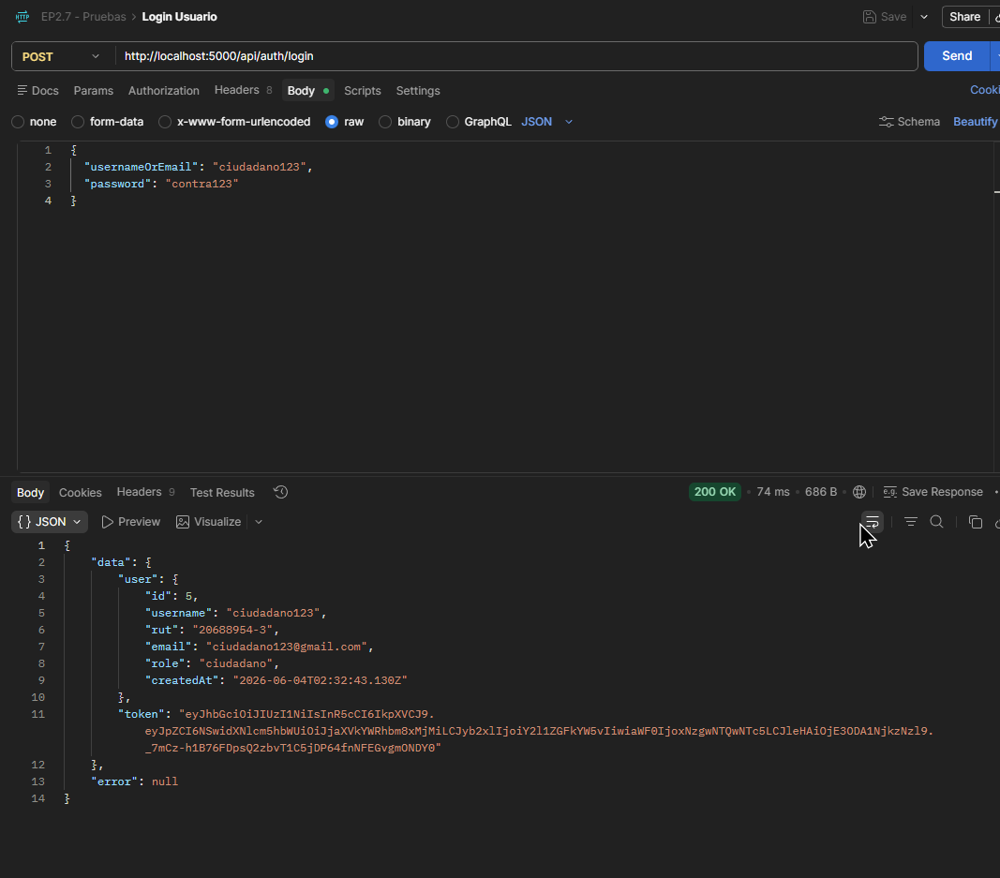
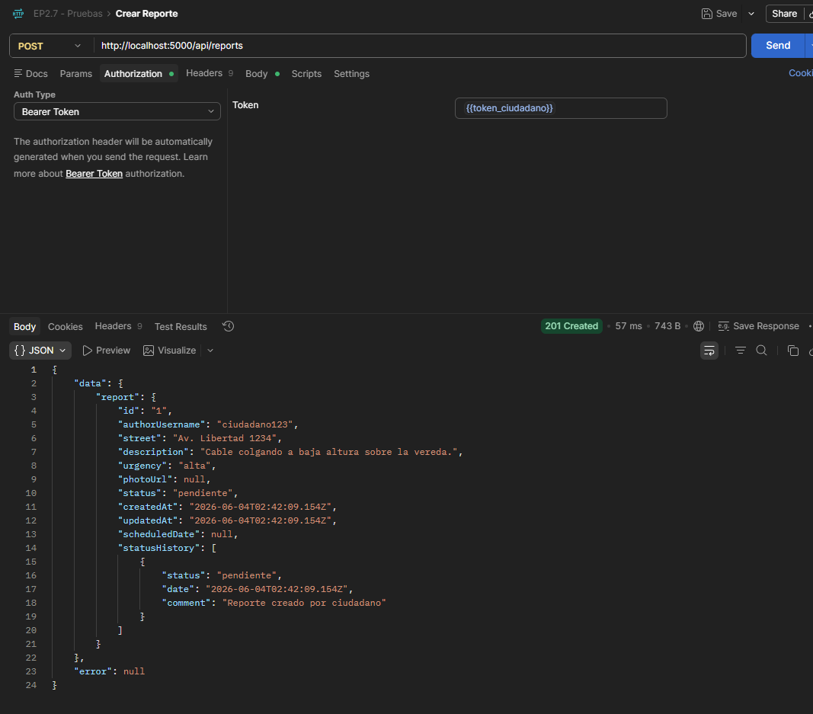
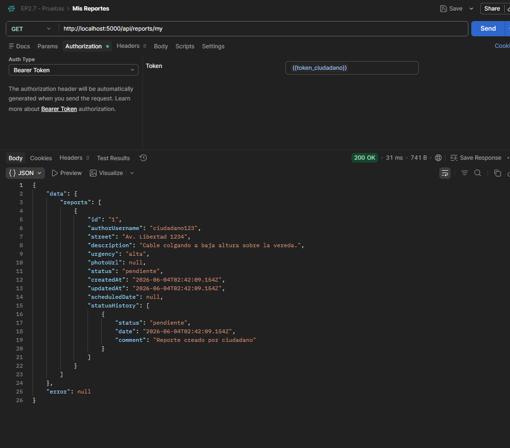
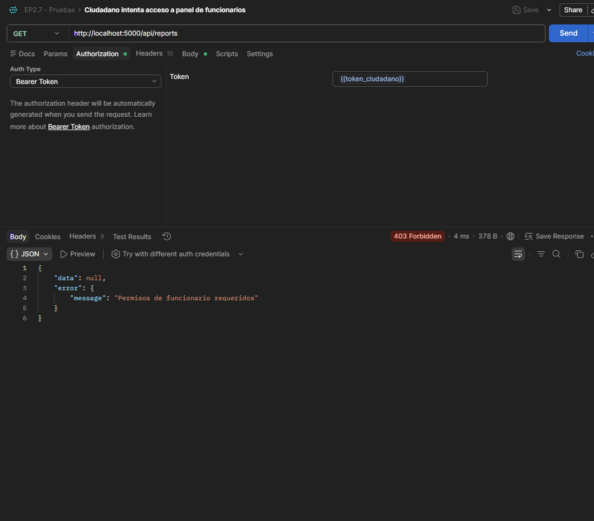
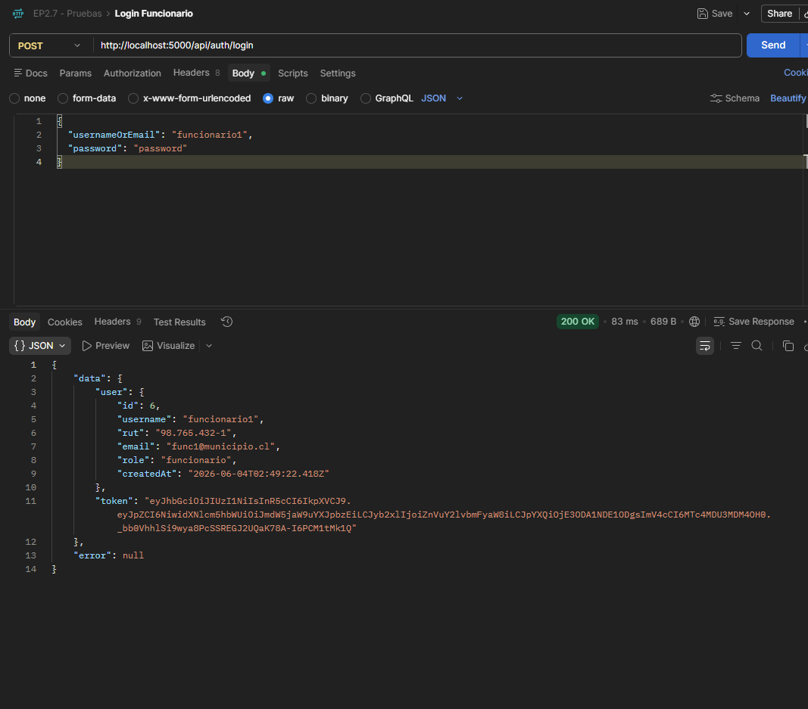
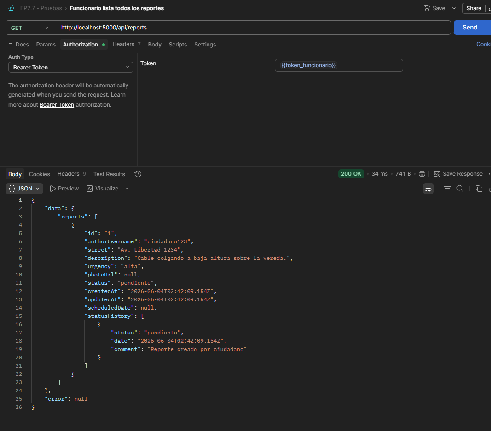
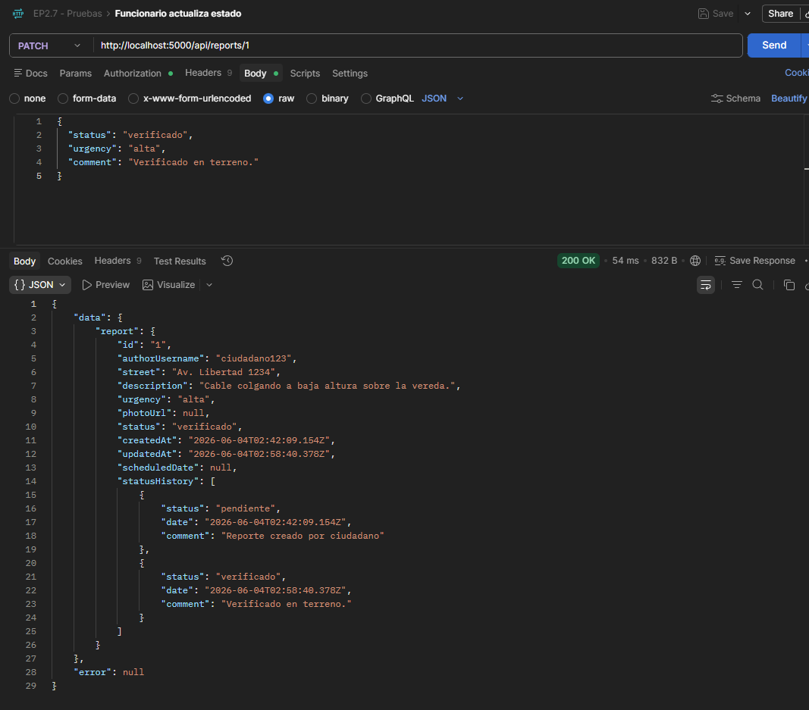
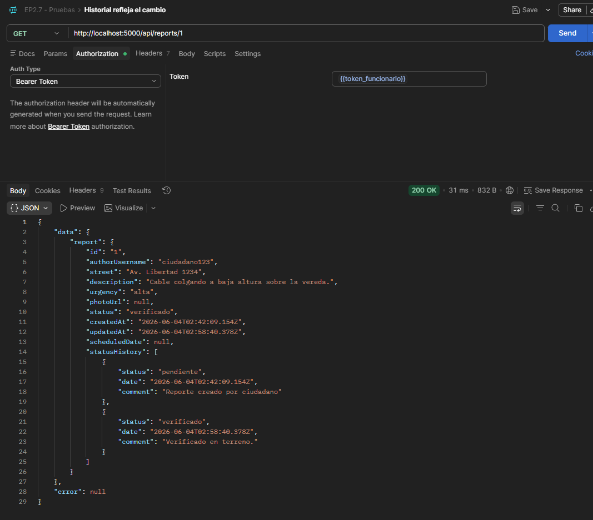

# EP2.7 (a) y (c): Pruebas en Postman + Evidencia de pruebas

---

## 1. Registrar ciudadano
**Método:** `POST /api/auth/register`  
**Resultado esperado:** `201 Created` con token en la respuesta  
**Evidencia:**

---

## 2. Login ciudadano
**Método:** `POST /api/auth/login`  
**Resultado esperado:** `200 OK` con token  
**Evidencia:**

---

## 3. Crear reporte (como ciudadano)
**Método:** `POST /api/reports`  
**Auth:** Bearer token de ciudadano  
**Resultado esperado:** `201 Created`  
**Evidencia:**

---

## 4. Mis reportes
**Método:** `GET /api/reports/my`  
**Auth:** Bearer token de ciudadano  
**Resultado esperado:** `200 OK` con array de reportes  
**Evidencia:**

---

## 5. Ciudadano intenta acceder al panel admin
**Método:** `GET /api/reports`  
**Auth:** Bearer token de ciudadano  
**Resultado esperado:** `403 Forbidden`  
**Evidencia:**

---

## 6. Login funcionario
**Método:** `POST /api/auth/login`  
**Resultado esperado:** `200 OK` con token de funcionario  
**Nota:** El usuario fue creado directamente en la BBDD.  
**Evidencia:**

---

## 7. Funcionario lista todos los reportes
**Método:** `GET /api/reports`  
**Auth:** Bearer token de funcionario  
**Resultado esperado:** `200 OK` con todos los reportes  
**Evidencia:**

---

## 8. Funcionario actualiza estado de reporte
**Método:** `PATCH /api/reports/1`  
**Auth:** Bearer token de funcionario  
**Resultado esperado:** `200 OK` con reporte actualizado  
**Evidencia:**

---

## 9. Historial refleja el cambio
**Método:** `GET /api/reports/1`  
**Auth:** Bearer token de funcionario  
**Resultado esperado:** `200 OK` con `statusHistory` mostrando `pendiente` -> `verificado`  
**Evidencia:**

